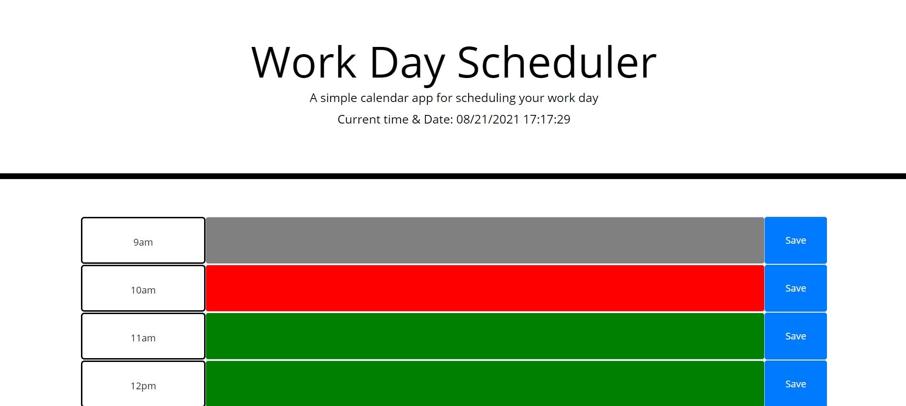

# work-day-scheduler
Week 5 HomeWork Assignment

## How to use
1. Open this link: [Github Pages Link](https://quentinhnilica.github.io/work-day-scheduler/)
2. Click the textbox you would like to edit
3. Hit the save button after you input to update your schedule. 
4. Refresh the page and notice your changes save.

## Design 
- Used bootstrap for styling the page.

## Features
- All inputed data will be saved
- The color of the input field will change based on the time of the day

## Languages Used
- JavaScript (Logic)
- HTML (Bones of site)
- Bootstrap (Styling)
- Css (For minor Tweeks)
